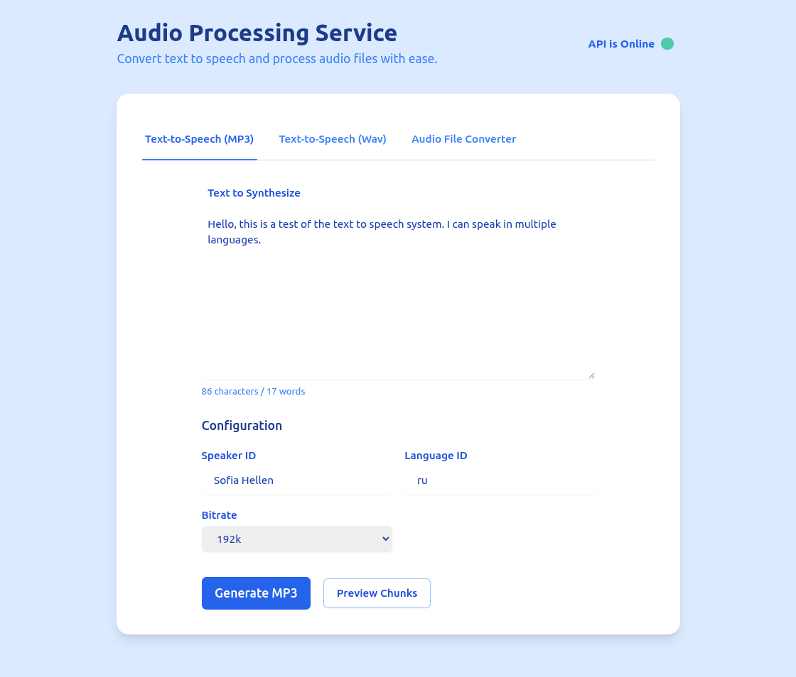

# Audio Processing and Text-to-Speech API

## Overview

This application provides endpoints for audio processing and text-to-speech (TTS) functionalities. It supports uploading
audio files, enhancing them, merging multiple segments, and generating speech from text.

## App



## Features

- **Audio Enhancement and Conversion**: Upload audio files (ZIP or supported formats) to enhance them using various
  processing techniques. The processed audio is merged into a single MP3 file for download.
- **Text-to-Speech (TTS)**: Convert text input into speech with customizable parameters such as speaker, language, and
  style. The output is an enhanced MP3 file ready for download.
- **Chunked TTS**: Generate raw WAV files for each chunk of the provided text. These chunks are bundled into a ZIP
  archive for detailed control over individual audio segments.
- **TTS Preview**: View how input text will be split into chunks without generating any audio, useful for understanding
  segmentation and planning content structure.
- **Multi-threading Support**: Utilize multi-threading to process multiple TTS requests concurrently, improving
  efficiency and reducing processing time.
- **Secure File Handling**: Ensure files are securely handled with checks for valid file types and secure filename
  sanitization to prevent security vulnerabilities.
- **Logging and Error Handling**: Comprehensive logging provides insights into the application's operations, while
  robust error handling ensures smooth user experience even in case of issues.

## Endpoints

### `/`

- **Method:** GET
- **Description:** Renders the main page of the application.
- **Response:** HTML page

### `/convert`

- **Method:** POST
- **Description:** Processes uploaded audio files by enhancing and merging them into a single MP3 file.
- **Request Parameters:**
    - `files`: List of audio files to be processed. Supported formats include `.wav`, `.mp3`, etc.
    - `bitrate` (optional): Bitrate for the output MP3 file (default is `192k`).
- **Response:** Enhanced and merged MP3 file

### `/tts`

- **Method:** POST
- **Description:** Generates speech from provided text using TTS parameters.
- **Request Parameters:**
    - `text`: Text to be converted into speech.
    - `speaker_id` (optional): ID of the speaker for the TTS (default is `'Sofia Hellen'`).
    - `language_id` (optional): Language code for the TTS (default is `'ru'`).
    - `style_wav` (optional): Path to a WAV file that influences the style of speech.
    - `bitrate` (optional): Bitrate for the output MP3 file (default is `192k`).
- **Response:** Generated MP3 file

### `/tts/preview`

- **Method:** POST
- **Description:** Shows how provided text will be chunked without processing it.
- **Request Parameters:**
    - `text`: Text to be previewed for chunking.
- **Response:** JSON object containing the original length, number of chunks, and details of each chunk.

### `/tts_chunked`

- **Method:** POST
- **Description:** Generates speech from provided text in raw WAV chunks and returns them as a ZIP file.
- **Request Parameters:**
    - `text`: Text to be converted into speech.
    - `speaker_id` (optional): ID of the speaker for the TTS (default is `'Sofia Hellen'`).
    - `language_id` (optional): Language code for the TTS (default is `'ru'`).
    - `style_wav` (optional): Path to a WAV file that influences the style of speech.
- **Response:** ZIP file containing raw WAV chunks

### `/health`

- **Method:** GET
- **Description:** Checks the health status of the application.
- **Response:** JSON object indicating the health status.

Certainly! Below are the `Usage` and `Notes` sections for your `app.py` in markdown format, following the provided
example:

## Usage

1. **Install Dependencies**:
   ```bash
   pip install flask pydub librosa soundfile numpy scipy requests python-ffmpeg edge-tts
   ```

2. **Run the Application**:
   ```bash
   python app.py
   ```

2. **Run the CoquiTTS server**:
   ```bash
   docker run --rm -it -p 5002:5002 --entrypoint /bin/bash ghcr.io/coqui-ai/tts-cpu
   ```
   _Note: Here is just an example, please refer to the documentation of the Coqui service itself._

4. **Access the Service**:

- Open a web browser and navigate to `http://localhost:5000` for the main page.
- Use tools like Postman or curl to interact with the following endpoints:
    - `/api/tts`: For text-to-speech conversion.
    - `/api/tts/preview`: To preview how text will be chunked without processing.
    - `/api/tts_chunked`: For generating raw WAV chunks of TTS output.
    - `/api/convert`: For enhancing and merging audio files.

## Notes

- **Dependencies**: Ensure that all dependencies are installed correctly. `pydub` requires `ffmpeg` to handle audio file
  conversions, so make sure `ffmpeg` is installed on your system.
- **Production Deployment**: For production use, consider deploying the application using a WSGI server such as Gunicorn
  or Waitress instead of Flask's built-in development server.
- **Environment Configuration**: Ensure that the `coqui_tts` server and any other external services are properly
  configured and accessible in your environment.
- **Temporary Files**: The application generates temporary files during processing. These files are automatically
  cleaned up after use, but ensure there is sufficient disk space available.

## Links

- [coqui-tts](https://github.com/coqui-ai/TTS)