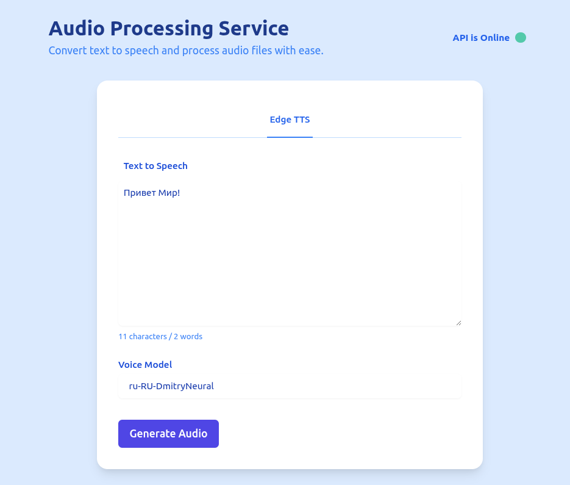

# Edge TTS API

This is a simple Flask application that provides a Text-to-Speech (TTS) service using the `edge_tts` library. The
application allows users to send text and receive an audio file in response.

## App



## Features

- **Text-to-Speech Conversion**: Convert text into speech using specified voice models.
- **Health Check Endpoint**: Verify if the service is running.
- **Main Page**: A simple HTML page for demonstration purposes.

## Endpoints

### Health Check

- **URL**: `/health` or `/api/health`
- **Method**: `GET`
- **Response**: JSON object indicating the status and current timestamp.

### Text-to-Speech Conversion

- **URL**: `/api/tts`
- **Method**: `POST`
- **Request Body** (JSON):
    - `text`: The text to convert into speech. Default is "Привет Мир!".
    - `voice`: The voice model to use for generating the speech. Default is "ru-RU-DmitryNeural".
    - `output_file`: The name of the output file. Default is "output.mp3".
- **Response**: Audio file as an attachment or error message.

## Usage

1. **Install Dependencies**:
   ```bash
   pip install flask edge-tts
   ```

2. **Run the Application**:
   ```bash
   python app.py
   ```

3. **Access the Service**:
    - Open a web browser and navigate to `http://localhost:5001` for the main page.
    - Use tools like Postman or curl to interact with the `/api/tts` endpoint.

## Notes

- For production use, consider deploying the application using a WSGI server such as Gunicorn or Waitress instead of
  Flask's built-in development server.
- Ensure that the `edge_tts` library is properly configured and accessible in your environment.

## Links

- [edge-tts](https://github.com/rany2/edge-tts)