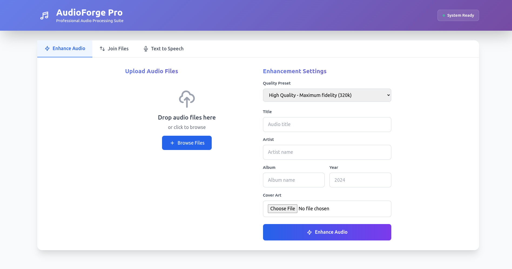

# AudioForge

This Flask-based service provides endpoints to process audio files, join multiple MP3 files, and generate
text-to-speech (TTS) audio. It includes functionalities such as extracting audio streams, enhancing audio quality,
adding ID3 tags, and returning processed files either individually or in a ZIP archive.

## App



## Features

- **Text-to-Speech Conversion**: Convert text into speech using specified voice models via the `/api/tts` endpoint.
- **Audio Enhancement**: Enhance audio quality for uploaded MP3 files or generated TTS audio using various presets via
  the `/api/enhance` and `/api/tts` endpoints.
- **ID3 Tagging**: Add ID3 tags to enhanced or joined audio files, including support for cover art.
- **MP3 File Joining**: Combine multiple MP3 files into a single file via the `/api/join` endpoint. Supports uploading
  individual MP3 files or a ZIP archive containing MP3s.
- **Health Check Endpoint**: Verify if the service is running and check availability of dependencies like FFmpeg via
  the `/api/health` endpoint.
- **Main Page**: A simple HTML page for demonstration purposes, accessible at the root URL (`/`).
- **Error Handling**: Custom error handling for common issues such as file size limits and invalid requests.

## Endpoints

### Health Check

- **URL**: `/api/health` or `/health`
- **Method**: `GET`
- **Description**: Returns the health status of the service along with dependency checks (e.g., FFmpeg availability).

### Enhance and Process Audio Files

- **URL**: `/api/enhance`
- **Method**: `POST`
- **Parameters**:
    - `files`: List of MP3 files to be processed.
    - `metadata` (optional): JSON string containing ID3 tags to add to the enhanced files.
    - `cover_art` (optional): File upload for cover art.
    - `preset` (optional, default: "podcast"): Preset for audio enhancement.

### Join MP3 Files

- **URL**: `/api/join`
- **Method**: `POST`
- **Parameters**:
    - `files`: List of MP3 files to be joined or a single ZIP archive containing MP3 files.
    - `metadata` (optional): JSON string containing ID3 tags to add to the final file.
    - `cover_art` (optional): File upload for cover art.
    - `output_name` (optional, default: "joined_audio.mp3"): Name of the output file.

### Generate TTS Audio

- **URL**: `/api/tts`
- **Method**: `POST`
- **Parameters**:
    - `text`: Text to be converted into speech.
    - `voice` (optional, default: "ru-RU-DmitryNeural"): Voice for the TTS audio.
    - `output_file` (optional, default: "tts_output.mp3"): Name of the output file.
    - `enhance` (optional, default: false): Boolean indicating whether to enhance the generated TTS audio.
    - `enhance_preset` (optional, default: "podcast"): Preset for audio enhancement if enabled.
    - `metadata` (optional): JSON string containing ID3 tags to add to the final file.
    - `cover_art` (optional): File upload for cover art.
    - `return_zip` (optional, default: false): Boolean indicating whether to return a ZIP archive with metadata.

Certainly! Below is the **Usage** and **Notes** section for the provided application, formatted similarly to the example
you provided:

## Usage

1. **Install Dependencies**:
   ```bash
   pip install flask mutagen ffmpeg-python requests
   ```

2. **Run the Application**:
   ```bash
   python app.py
   ```

2. **Run the Edge-TTS Application**:
   ```bash
   cd edge-tts
   ./build.sh
   ```

4. **Access the Service**:

- Open a web browser and navigate to `http://localhost:5003` for the health check endpoint.
- Use tools like Postman or curl to interact with the API endpoints:
    - `/api/tts`: Generate TTS audio.
    - `/api/join`: Join multiple MP3 files into one.
    - `/api/enhance`: Enhance uploaded MP3 files (via `/api/enhance` is not explicitly defined, but you can
      use `/api/tts` with enhancement).
    - `/api/health`: Check the health status of the service.

5. **Example Requests**:

- **Generate TTS Audio**:
  ```bash
  curl -X POST http://localhost:5003/api/tts \
       -H "Content-Type: application/json" \
       -d '{"text": "Hello, world!", "voice": "en-US-JennyNeural", "output_file": "hello.mp3"}'
  ```

- **Join MP3 Files**:
  ```bash
  curl -X POST http://localhost:5003/api/join \
       -F 'files=@file1.mp3' \
       -F 'files=@file2.mp3' \
       -F 'output_name=joined_audio.mp3'
  ```

- **Enhance MP3 Files**:
  ```bash
  curl -X POST http://localhost:5003/api/tts \
       -H "Content-Type: application/json" \
       -d '{"text": "Hello, world!", "voice": "en-US-JennyNeural", "output_file": "hello.mp3", "enhance": true}'
  ```

## Notes

- **FFmpeg Dependency**: Ensure that `ffmpeg` is installed on your system and accessible in the PATH. You can download
  it from [FFmpeg's official website](https://ffmpeg.org/download.html).

- **Production Deployment**:
    - For production use, consider deploying the application using a WSGI server such as Gunicorn or Waitress instead of
      Flask's built-in development server.
      ```bash
      gunicorn app:app --bind 0.0.0.0:5003
      ```

- **Environment Variables**:
    - You can configure environment variables to adjust the application settings, such as `FLASK_DEBUG`
      and `MAX_CONTENT_LENGTH`.
      ```bash
      export FLASK_DEBUG=True
      export MAX_CONTENT_LENGTH=10485760  # 10MB limit
      ```

- **TTS Server URL**:
    - The TTS server URL (`SERVER_URL`) is hardcoded in the script. Ensure that this URL points to a valid and
      accessible TTS service.

- **Error Handling**:
    - The application includes basic error handling, but for production use, consider implementing more robust logging
      and monitoring.

- **Security Considerations**:
    - Be cautious when deploying this application publicly, as it can handle file uploads. Ensure that you have proper
      security measures in place to prevent unauthorized access or malicious activities.

- **ID3 Tags**:
    - When enhancing or joining files, the application attempts to preserve and apply ID3 tags. Ensure that the metadata
      provided is correctly formatted JSON.

By following these instructions and notes, you should be able to set up and use the application effectively for
generating, enhancing, and joining MP3 audio files.

## Links

- [ffmpeg](https://ffmpeg.org/)